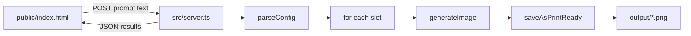

# Simple prompt submit UI

## Behavior

- One local page: paste a structured prompt → **Submit** → generate posters.
- Reuse existing logic in `[src/generate-posters.ts](src/generate-posters.ts)`: `parseConfig` → `buildPrompt` → `generateImage` → `saveAsPrintReady`.
- Same rules: hard cap (current `MAX_IMAGES`), no retries, one model, save to `output/poster-XX.png`.
- You write the prompt however you like (e.g. with Perplexity); for best results include lines like `Generate N … images`, `Style:`, `Colors:`, `Composition:`, `Subjects:`, `Format:` — missing fields still get defaults + warnings.

## Implementation

1. **Extract a shared runner** in `[src/generate-posters.ts](src/generate-posters.ts)`
  - Add `export async function runGeneration(rawText: string)` that contains the parse → cap → loop logic currently in `main()`.
  - Return `{ files: string[], errors: string[], count: number }`.
  - Keep CLI `main()` calling `runGeneration` after reading `--file` / default config.
2. **Add a tiny server** `[src/server.ts](src/server.ts)` (Node `http`, no Express)
  - `GET /` → serve `[public/index.html](public/index.html)`
  - `GET /output/:name` → serve generated PNGs for preview
  - `POST /api/generate` → JSON `{ prompt: string }` → `runGeneration(prompt)` → JSON results
  - Port `8787` (logged on start)
3. **Simple page** `[public/index.html](public/index.html)`
  - Textarea (prefilled with a short example / placeholder of the woodland format)
  - Submit button
  - Status area (“Generating… this can take a few minutes”)
  - On success: list saved filenames + small image previews via `/output/...`
  - Disable submit while a run is in progress
4. **Scripts** in `[package.json](package.json)`
  - `"ui": "ts-node src/server.ts"`
  - Brief note in `[README.md](README.md)`: `npm run ui` then open `http://localhost:8787`

## Out of scope

- No Etsy listing, mockups, SEO, auth, or cloud deploy
- No change to the Replicate model or retry policy

