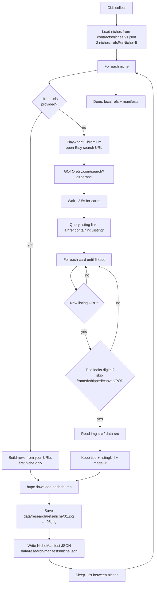

# Research pipeline

Python app under `apps/research` that collects Etsy niche references, extracts style features, writes **original** structured prompts compatible with the TypeScript generator, and hands off generation.

## Setup

```bash
# from repo root
python -m pip install -r apps/research/requirements.txt
python -m playwright install chromium
```

Requires root `.env` with `REPLICATE_API_TOKEN` (shared with the generator).

## Collect / scrape flowchart

Implementation: `apps/research/research_pipeline/crawl/etsy.py`.  
Entry: `npm run research:collect` or `python -m research_pipeline.cli collect`.



### How scrape works (plain terms)

1. Reads the top 3 niches and “5 images each” from `contracts/niches.v1.json`.
2. For each niche, opens that Etsy search in Playwright — or uses `--from-urls` if crawl is blocked.
3. Keeps up to **5** listing cards that look digital (title filter skips framed/shipped/canvas/POD).
4. Downloads thumbnails to `data/research/refs/<slug>/`.
5. Writes a manifest JSON (title, listing URL, image URL, local path) under `data/research/manifests/`.

Later pipeline steps (not scrape): `analyze` → `prompt` → `generate`.

## Shop scrape (specific seller)

Implementation: `apps/research/research_pipeline/crawl/shop.py` + `scripts/scrape-shop.cjs`.  
Config: `contracts/shops.v1.json`.

Configured shops:

- **EdLPrintableDesigns** — clipart / digital paper study (`limit` 12)
- **TapIntoDigital** — Pixar/3D-style custom portrait gifts (`limit` 48, paginated deep sample)

```bash
npm run research:collect-shop
# or pick a shop
node scripts/research.cjs collect-shop --shop edl-printable-designs --limit 12
node scripts/research.cjs collect-shop --shop tap-into-digital --limit 48
node scripts/research.cjs collect-shop --shop "https://www.etsy.com/shop/TapIntoDigital"
# if headless Etsy returns 0 cards (bot wall), load a saved listings array:
node scripts/research.cjs collect-shop --shop tap-into-digital --from-json data/research/manifests/tap-into-digital.raw.json
```

What it does:

1. Opens the shop in **Node Playwright** (`scripts/scrape-shop.cjs`; auto-retries headed if headless returns 0) and paginates with `?page=N` until the limit or no new cards.
2. Keeps up to N digital-looking listings.
3. Saves thumbs to `data/research/refs/<shop-slug>/`.
4. Writes manifest `data/research/manifests/<shop-slug>.json`.
5. Writes public-signal pattern notes to `docs/SHOP_<SLUG>.md` (signals/hypotheses from `contracts/shops.v1.json` + theme counts from titles — **not** true sales ranks).

**Windows note:** Shop scrape uses Node Playwright only. Etsy may still serve an empty page to browsers; use `--from-json` with a captured listings array, or `node scripts/scrape-shop.cjs <url> <limit> out.json --headed`.

Etsy does not expose private sales data to scrapers. Treat shop notes as directional only; inspiration, not copying.

## Commands

From repo root:

```bash
npm run research:collect          # crawl top 3 niches × 5 thumbs
npm run research:collect-shop     # scrape default/configured shop
npm run research:analyze          # vision (or heuristic fallback)
npm run research:prompt           # write data/prompts/research-*.txt
npm run research:generate         # npm run dev -- --file …
npm run research:all              # full pipeline

# equivalents
node scripts/research.cjs collect
node scripts/research.cjs collect-shop --shop tap-into-digital --limit 48
node scripts/research.cjs collect-shop --shop edl-printable-designs
node scripts/research.cjs analyze --no-vision
node scripts/research.cjs run-all --skip-generate
node scripts/research.cjs collect --from-urls https://example.com/a.jpg https://example.com/b.jpg
```

## Niches (v1)

Defined in `contracts/niches.v1.json`:

1. Soft storybook nursery animals — `nursery animal digital art`
2. Warm-neutral botanical gallery — `botanical gallery wall printable`
3. Japandi / Scandi calm — `japandi printable wall art`

## Contracts

| File | Purpose |
|------|---------|
| `contracts/MODELS.json` | image + vision model IDs, maxImages, print defaults |
| `contracts/niches.v1.json` | niche list |
| `contracts/shops.v1.json` | shop scrape targets (EdL, TapIntoDigital, …) |
| `contracts/poster-config.schema.json` | shared PosterConfig |
| `contracts/manifest.schema.json` | crawl manifest |
| `contracts/style-features.schema.json` | vision rollup |

Python emits the **same labeled prompt dialect** the TS parser expects:

```text
Generate N vertical poster images for {theme}.
Style: …
Colors: …
Composition: …
Subjects: …
Format: 18x24 inches at 300 DPI, suitable for wall art.

Creative brief:
…
```

## Legal / originality

Reference thumbs are for **market pattern / style extraction only**. Do not copy seller compositions, titles, tags, or mockups. Prompts instruct original subjects and include niche risk notes from the research brief.

## Crawl limitations

Etsy is JS-heavy and may block automated browsers. If crawl fails, use `--from-urls` with images you already have, then continue `analyze` → `prompt` → `generate`.
