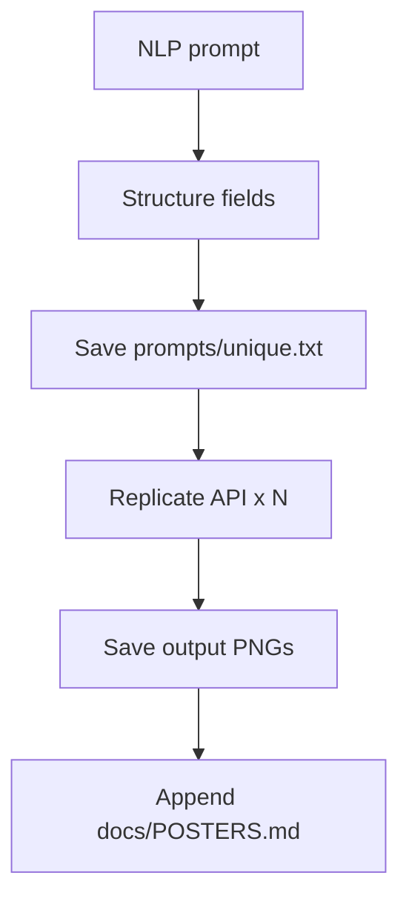

# Generation workflow

Natural-language input is turned into a structured prompt, saved, sent to Replicate, and logged.

## Steps

1. **Receive NLP** — You paste a freeform idea in the UI (`npm run ui`) or pass a text file via CLI.
2. **Build structured prompt** — Backend infers count, style, colors, composition, subjects, and format; keeps your original text as the creative brief. Does not invent new subjects.
3. **Save unique prompt file** — Writes `prompts/<timestamp>-<slug>.txt`.
4. **Call Replicate API** — One call per image slot to `black-forest-labs/flux-kontext-pro` (hard cap applies; no retries).
5. **Save print-ready PNGs** — Resized/cropped with `sharp` to `output/<runId>-poster-XX.png`.
6. **Update poster log** — Appends a row to [`POSTERS.md`](POSTERS.md).



## Run

```bash
npm run ui
```

Open `http://localhost:8787`, paste your idea, click **Submit**.

CLI (same workflow):

```bash
npm run dev -- --file config/Ganesha.txt
```
